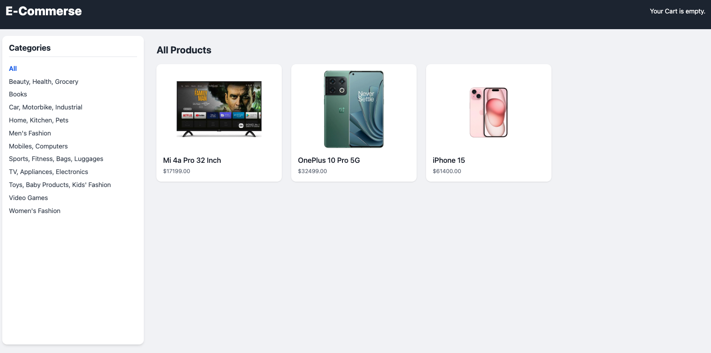
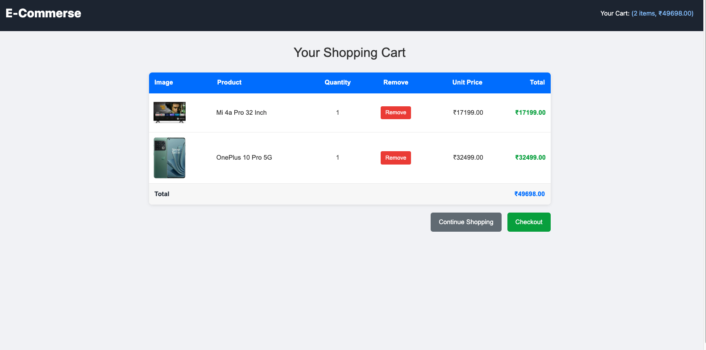

# 🛒 Django E-Commerce Website

A fully functional and responsive e-commerce website built with **Django**, **Tailwind CSS**, **Razorpay**, and **Celery**. The platform includes product browsing, category filters, cart management, checkout process, and Razorpay payment integration.

---

## 📷 Snapshots

### 🏠 Homepage


### 🛍️ Product List


### 📦 Product Detail


### 🧾 Checkout Page


---

## 🚀 Features

- User-friendly responsive UI with Tailwind CSS
- Category and subcategory filters
- Add to cart and update quantity
- Order summary and checkout
- Razorpay payment integration
- Order history
- Celery integration for async tasks (e.g., email)

---

## 🛠️ Tech Stack

- **Backend**: Django, Celery
- **Frontend**: Tailwind CSS
- **Database**: SQLite (you can switch to PostgreSQL)
- **Payment**: Razorpay
- **Task Queue**: Celery + Redis

---

## 📂 Installation

1. Clone the repo:

```bash
git clone https://github.com/yourusername/your-repo-name.git
cd your-repo-name
